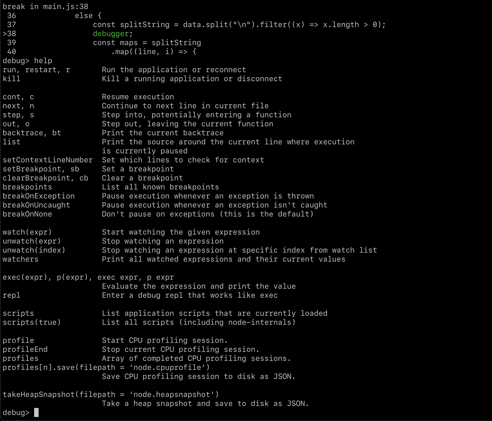

# How to debug Typescript while using Neovim
It's basically a pain in the a** to debug things in general in neovim and I didn't want to loose a million years on a setup.
A quick work around is to simply use the `inspect` flag that comes with node. (It's available in deno & bun, but I don't know that for sure).

```bash
# you need to have tsconfig.json properly configured
tsc && node inspect main.js example.txt
```

Then make sure that changed in your code you have the `debugger` keyword used.


When you run the command, it will trigger a debugger in the cli 


This is not exactly what we want, since we want to use the Chrome dev tools debugger that comes with a lot of nice things (Mostly the UI).


You can use of course use the CLI, but you don't have all the variables in the scope defined on the right side like you would in the UI.


It will look like this, make sure to expose source-maps in the `tsconfig.json`.

```json
{
  "compilerOptions": {
    "target": "ESNext",
    "module": "commonjs",
    "strict": true,
    "esModuleInterop": true,
    "sourceMap": true
  }
}
```

The proper way to do it in neovim would be to use a DAP but make sure it makes sense in terms of time investment for you.

Extra material to read here:

https://miguelcrespo.co/posts/debugging-javascript-applications-with-neovim/

https://miguelcrespo.co/posts/how-to-debug-like-a-pro-using-neovim

https://microsoft.github.io/debug-adapter-protocol/


