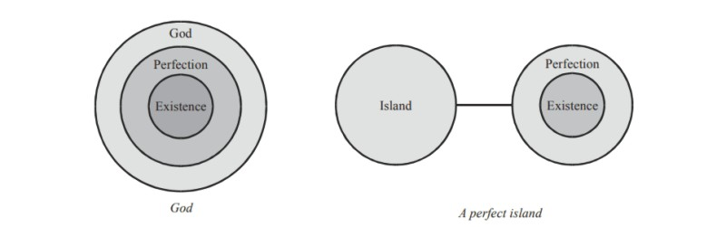
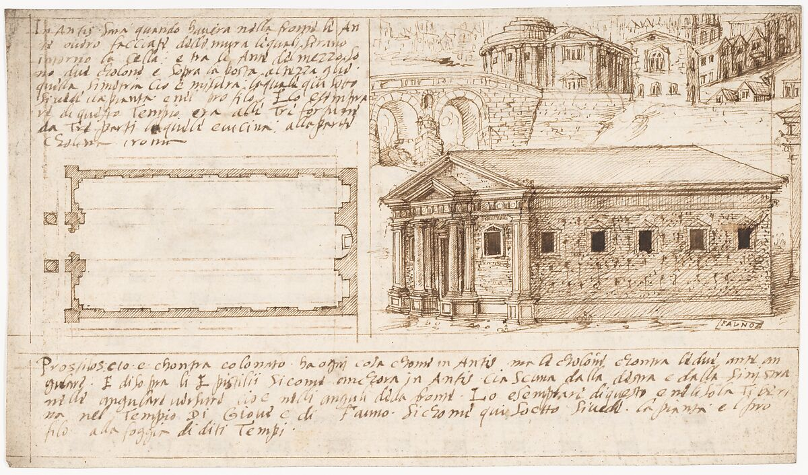

A while ago, I started thinking about approaches for building things while I was on a plane.

The thought of being in a metallic tube 10.000m above ground and traveling at 900km/h really made me think about how smart some people are and how they made sure that every single bolt has it's purpose.

Building tangible (a plane) & non-tangible (software) objects requires someone to do the building.

There are some differences but I wondered if maybe there was some inspiration that could be taken from how physical systems are built. Specifically how the process of _building_ happens.

In order to come up with a plan to build something, you need to be very good at reasoning.

One guy that knows a thing or two about reasoning is 17th century french polymath [René Descartes](https://en.wikipedia.org/wiki/Ren%C3%A9_Descartes). I used to f*cking hate studying his stuff in high school but have found a new interest for him now that there are no grades or exams or any other academical hierarchy breathing down my neck.


Anyways, Descartes had a very interesting life and spent a lot of time thinking. (I honestly wonder sometimes how these philosophers were getting by financially).

# Discourse on the Method

He wrote this amazing book called ["Discourse on the Method"](https://en.wikipedia.org/wiki/Discourse_on_the_Method) and it was exactly what I was looking for. He basically delves into his approach to the scientific method and philosophical inquiry.


Here are some of the general points that he goes through that are not necessarily related to software, but more to reasoning in general, and we can use that as a baseline to draw parallels.

## Method of doubt

Descartes aims to establish a new method for acquiring knowledge that is more reliable than traditional scholastic methods. He advocates for a systematic, doubt-based approach to understanding the world.

<iframe
  width="420"
  height="315"
  src="https://www.youtube.com/embed/DO2ojvU-UaI"
  frameborder="0"
  allow="autoplay; encrypted-media"
  allowfullscreen>
</iframe>

What we can draw from 2Pac & Descartes is very much applicable to software systems. Approaching it with an assumption of certainty and complete blind trust will only lead to two things:
- you will be less careful when changing it.
- you will break things by being less careful.


## "Cogito, Ergo Sum" aka "I think, therefore I am"

This doesn't have anything to do with software, but while you're in here, I might as well just go through it too.

In other words, the very act of doubting or thinking about your existence proves that you exist. If you're questioning whether you exist, the fact that you are capable of having that thought means you must be real.

He argued in a [different book](https://en.wikipedia.org/wiki/Meditations_on_First_Philosophy) that even if an all-powerful demon were to try to deceive him into thinking that he exists when he does not, he would have to exist in order for the demon to deceive him. Therefore, whenever he thinks, he exists.


## Dualism & God 

He then believes that your mind and your body are different and separate things. The mind is not the same as the physical brain, even though they interact with each other.

And then this picture explains it pretty well about why God is perfect according to him.

[Cool article about this subject if you want to learn more](https://www.blacksacademy.net/pages/px-018-pxqron-ontological-argument.php)

Congratulations, you can call yourself an expert in modern philosophy now!

In the book he then goes and talks about these "precepts of logic".

# Precepts of logic

## Skepticism

`Never accept anything for true, which I did not clearly know to be such. Carefully avoid precipitancy and prejudice.
Comprise nothing more in my judgment than what was presented to my mind so clearly and distinctly as to exclude all ground of doubt.`

**software parallel 🤖**: Super useful to have this mindset when debugging. Fishing for edge-cases.

## Divide-et-impera

`Divide each of the difficulties under examination into as many parts as possible and as might be necessary for its adequate solution.`

**software parallel 🤖**: Many algorithms use this technique to make them more efficient. Split big into small.

_**other parallels**: The roman empire also used this technique to conquer most of Europe when it was at it's peak, I believe that the term was coined by them. Anyone tackling any form of big complexity needs to do that. Assembling your IKEA furniture requires this as well._

## Ascendent complexity

`Conduct your thoughts in such order. By commencing with objects the simplest and easiest to know, I might ascend little, by little to more complex knowledge. Assigning in though a certain order even to those objects which in their own nature do not stand in a relation of antecedence and sequence.`

**software parallel 🤖**: Very useful if you do a lot of greenfield projects. Or again in big tasks, use a mix of divide-et-impera with some ascendant complexity.

## Enumerations

`Make enumerations so complete and reviews so general that I might be assured that nothing was omitted.`

**software parallel 🤖**: PR reviews, some people take them waaaay too seriously and that's great!

# Absolute bars that he dropped

**bar**: `"for to hold converse with those of other ages and to travel, are almost the same thing"`

**translation**: Go f*cking travel. It's ok to leesh knowledge from others.


**bar**: `"Those in whom the faculty of reason is predominant, and who most skilfully dispose their thoughts with a view to render them clear and intelligible, are always the best able to persuade others of the truth of what they down"`

**translation**: It's not enough to build great things, you also have to learn how to explain why they're great. This is analogous to having good documentation in your software.

**bar**: `"Everything is up for dispute in Philosophy. That does not seem to be the case with mathematics. There seems to be no solid superstructures for philosophy"`

**translation**: Spot the difference between empirical & non-empirical. Trust one more than the other.

# Other code parallel

```
“Buildings that a single architect has planned and executed,
are more generally elegant and commodious than
those which several have attempted to improve
by making old walls serve for purposes for
which they were not originally built.”
```



This one is a great one! This is similar to the _too many cooks in a kitchen_ problem. Or _one good dictator is better than 10 terms of democratically elected leaders that cancel each other out and get very little done_.

In software, most code at scale is usually not going to be written by a single person. I think we just have to accept it for what it is and work around it.

In project/engineering management, this needs to also be accounted for. Sometimes the foundations are just not solid enough to keep on stacking bricks on top.
Initial conditions are not necessarily constant.

```
“Nations starting from a semi-barbarous state
and advancing to civilisation by slow degrees,
have had their lows successfully determined and, as it were,
forced upon them simply by experience of the hurtfulness
of particular crimes and disputes”.
```

You (semi-barbarous state) learn (advancing) the most from bugs (lows) that you deal with (experience of crimes & disputes).


# Final thoughts

I think that we shouldn't be limited in basing our knowledge on [how to do software](https://en.wikipedia.org/wiki/The_Pragmatic_Programmer) from the early 60's until now. All of this Agile shit is maybe nice, new & shiny but human endeavours with unfathomable complexity have been tackled in the past that using various different frameworks of though that should also be included and valued. There's almost this phenomenon of _knowledge or methodology agism_ in software, where the value of a particular of information is derived by how recent it is.
